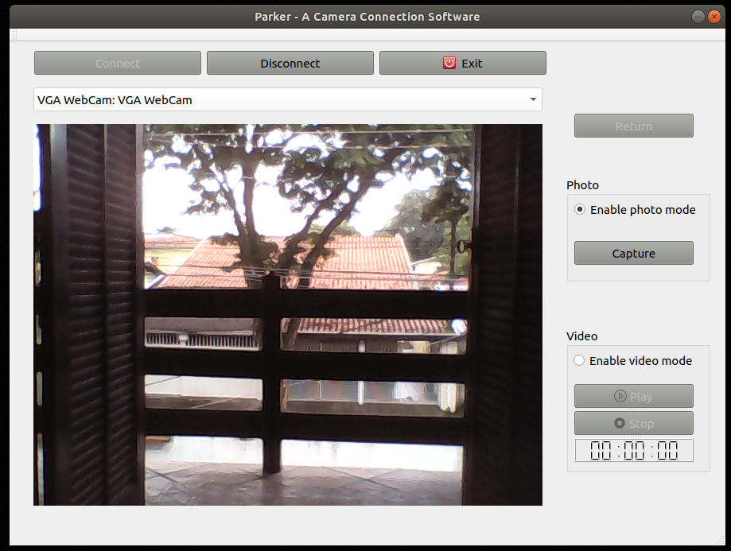

# Parker: A Camera Connection Software on Qt

App build in C++ with Qt Creator which detects and connect with all cameras available in the computer. Named after our great hero spider-man.

# About this Project

This app is build with pure C++ with the framework Qt Creator 5.12. 

# Getting Started

**Prerequisites**

To run this project, you'll need to have g++ and Qt Creator installed.

**Installing**

To install the g++ compiler for C++ code, run this on terminal:

	$ sudo apt install g++
	
Download and Install Qt from [here](https://www.qt.io/download?hsCtaTracking=f24f249b-61fb-4dec-9869-50512342f8d9%7Cf3adf380-4740-4f7e-9e49-d06fa99445fa).

After that, clone thhi Repository:

    $ git clone https://github.com/awcasella/Camera-Connection-Qt.git
  
Launch Qt Creator, and open the file "CameraConnection/CameraConnection.pro". This will open all the related files of this project in Qt.

To run the project, click on the green triangle on the left bottom part of the window. This will make the window pop just link in the screenshot above.

# Built With
- [Qt](https://www.qt.io): Cross platform software development for embedded systems.

# Note

Video function is still a work in progress.
